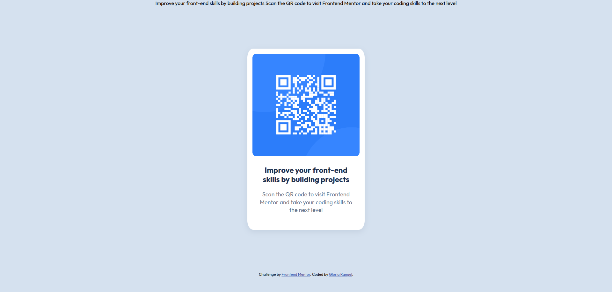
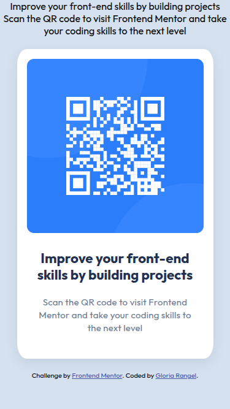

# 🖼 Frontend Mentor - QR code component solution

This is a solution to the [QR code component challenge on Frontend Mentor](https://www.frontendmentor.io/challenges/qr-code-component-iux_sIO_H). Frontend Mentor challenges help you improve your coding skills by building realistic projects.

## 📋 Table of contents

- Overview
- Screenshot
- Links
- My process
- Built with
- Useful resources
- Author
- Thanks

## 📖 Overview
My first Frontend Mentor challenge involved creating a QR code component using HTML5 and CSS, ensuring it closely matched the provided design. The goal was to achieve a consistent appearance across both desktop and mobile versions.

### 📸 Screenshot
These are the screenshots of the implemented solution:

- **🖥️ Desktop version**  
  

- **📱 Mobile version**  
  

### ⛓️ Links

- HTML URL: [index.html](https://github.com/NorimNori/qr-code-component/blob/main/index.html)
- CSS URL: [styles.css](https://github.com/NorimNori/qr-code-component/blob/main/styles.css)
- Live Site URL: [on Netlify](https://qr-code-component-by-gr.netlify.app)

## 📌 My process

### 🪚 Built with

- Semantic HTML5 markup
- CSS custom properties
- Flexbox
- CSS Grid
- Mobile-first workflow

### 🔬 What I learned

Through the mini QR card project, I gained valuable experience in implementing semantic HTML more effectively, ensuring better accessibility and structure. Additionally, I improved my skills in writing responsive code, allowing the design to adapt seamlessly across different screen sizes and devices.

### 📝 Useful resources

- [CSS Grid](https://stackoverflow.com/questions/73124414/how-to-make-css-grid-with-fixed-header-and-footer-with-remainder-in-middle) - This ensured that the footer remained fixed in place, regardless of the page's content.

## 👋 Author

- LinkedIn - [Gloria Rangel](https://www.linkedin.com/in/gloria-rangel-06b960306/)
- Frontend Mentor - [@NorimNori](https://www.frontendmentor.io/profile/NorimNori)

## 🌟 Thank You 🌟
Thanks for visiting this repository! I hope you found it useful and inspiring, or it was just a fun time.  

A special thanks to [Frontend Mentor](https://www.frontendmentor.io) for the challenge and for being such an amazing platform to learn and grow as a developer.  

Have a nice day! 😊
